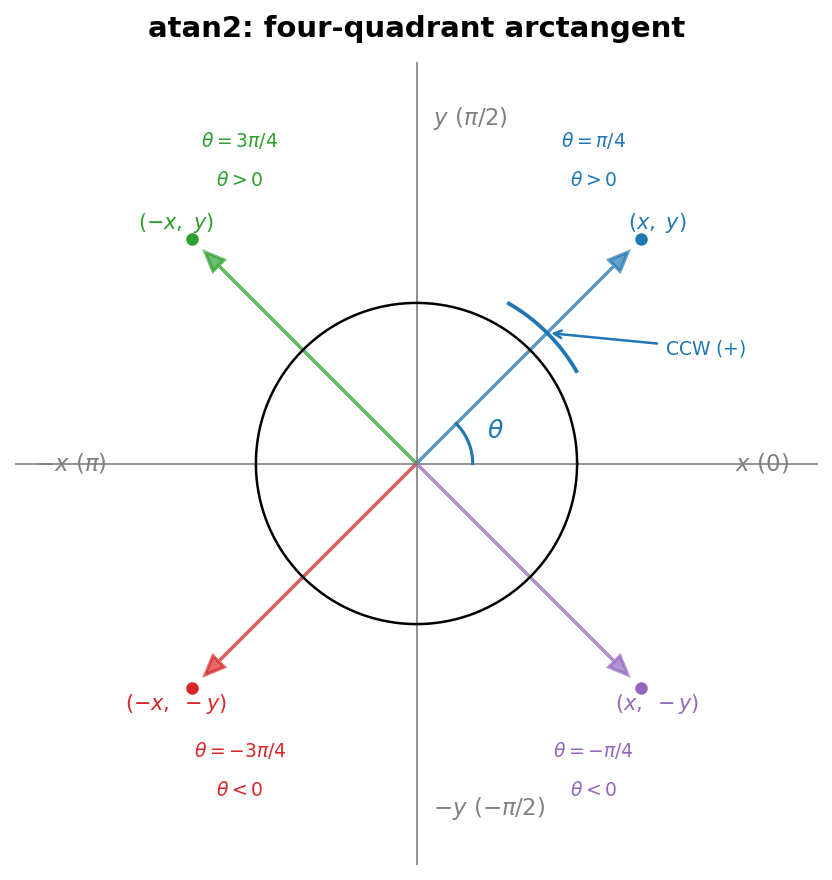

# `_order_h_by_angle_projection` 几何算法

H 原子的几何排序通过投影 + atan2 逆时针角度实现。以下用代码和数学公式对照解释每一步。

---

## 1. 定义 z 轴（参考方向）

```python
z_axis = ref_pos - center_pos
z_axis = z_axis / np.linalg.norm(z_axis)
```

z 轴是 center → ref 的单位向量。从 ref 方向"看回去"，H 原子在垂直于 z 的平面上形成投影点，然后在平面内做 CCW 排序。

ref 的选择取决于场景：

- sp3 有非 H 邻居（如 R-CH₃）：ref = 唯一的非 H 邻居
- sp3 全 H（如 CH₄）：ref = min-idx 的 H（该 H 排第一，其余排序）
- sp3d / sp3d2：ref = `_get_z_plus_ref` 确定的 z⁺ 端原子

---

## 2. 构建 x 轴（Gram-Schmidt 正交化）

x 轴只需是 ⟂z 平面内的任意方向。用不平行于 z 的种子向量经 Gram-Schmidt 正交化得到：

```python
arbitrary = np.array([1.0, 0.0, 0.0]) if abs(z_axis[0]) < 0.9 else np.array([0.0, 1.0, 0.0])
x_axis = arbitrary - np.dot(arbitrary, z_axis) * z_axis
x_axis = x_axis / np.linalg.norm(x_axis)
```

记种子向量为 $\vec{a}$，z 轴单位向量为 $\vec{z}$：

$$
\vec{x} = \frac{\vec{a} - (\vec{a} \cdot \vec{z}) \vec{z}}{\|\vec{a} - (\vec{a} \cdot \vec{z}) \vec{z}\|}
$$

其中 $\vec{a} - (\vec{a} \cdot \vec{z})\vec{z}$ 是从 $\vec{a}$ 中减去它在 $\vec{z}$ 方向的分量，剩余部分在 ⟂z 平面内。归一化后即得单位 x 轴。

种子向量的选取规则：优先用世界 x 轴 $[1,0,0]$，若 z 轴已接近 x 轴（$|z_x| \ge 0.9$），改用 $[0,1,0]$。这避免了 $\vec{a}$ 和 $\vec{z}$ 共线导致 $\vec{a} - (\vec{a}\cdot\vec{z})\vec{z} \approx \vec{0}$ 的退化。

---

## 3. 构建 y 轴（叉积）

```python
y_axis = np.cross(z_axis, x_axis)
```

$$
\vec{y} = \vec{z} \times \vec{x}
$$

由于 $\vec{z}$ 和 $\vec{x}$ 已经正交且都是单位向量，$\vec{y}$ 也是单位向量，且 $\{\vec{x}, \vec{y}, \vec{z}\}$ 构成**右手系**正交基底。

右手系意味着：从 $\vec{z}$ 正方向（ref 端）看向原点（center），$\vec{x}$ 逆时针旋转 90° 到达 $\vec{y}$。

---

## 4. 投影 H 原子到 ⟂z 平面

```python
vec = h_pos - center_pos
vec_proj = vec - np.dot(vec, z_axis) * z_axis
```

对于每个 H 原子，计算 center → H 的向量 $\vec{v}_i$，去掉 z 分量：

$$
\vec{v}_i^\perp = \vec{v}_i - (\vec{v}_i \cdot \vec{z}) \vec{z}
$$

$\vec{v}_i^\perp$ 是在 ⟂z 平面内的二维向量，其在 {x, y} 基底下的坐标为：

$$
x_i = \vec{v}_i^\perp \cdot \vec{x}, \qquad y_i = \vec{v}_i^\perp \cdot \vec{y}
$$

---

## 5. `atan2` 计算角度

```python
angle = np.arctan2(np.dot(vec_proj, y_axis), np.dot(vec_proj, x_axis))
```

即：

$$
\theta_i = \operatorname{atan2}(y_i, x_i)
$$

### `atan2` vs `atan`

| 函数 | 输入 | 输出范围 | 问题 |
| :--- | :--- | :--- | :--- |
| `atan(y/x)` | 比值 | $(-\pi/2, \pi/2)$ | 丢失象限信息（x < 0 时歧义），x = 0 时除以零 |
| `atan2(y, x)` | 两个分量 | $(-\pi, \pi]$ | 完整覆盖整个圆，x = 0 也能正确处理 |

### 几何含义

$\operatorname{atan2}(y, x)$ 是向量 $(x, y)$ 与 x 轴正方向的夹角，**逆时针为正**：



具体值举例：

| `atan2(y, x)` | 角度 | 含义 |
| :--- | :--- | :--- |
| `atan2(1, 1)` | $\pi/4$ | 45°，第一象限 |
| `atan2(1, -1)` | $3\pi/4$ | 135°，第二象限 |
| `atan2(-1, -1)` | $-3\pi/4$ | -135°，第三象限 |
| `atan2(0, 1)` | $0$ | 正 x 轴 |
| `atan2(1, 0)` | $\pi/2$ | 正 y 轴 |
| `atan2(-1, 0)` | $-\pi/2$ | 负 y 轴 |

## 6. 按角度排序

```python
angles.sort()
return [h_idx for _, h_idx in angles]
```

按角度升序排列，即从 $-\pi$ 附近开始，沿逆时针方向依次经过 $0 \to \pi/2 \to \pi$。得到的顺序是 CCW（逆时针）。

## 7. 确定性保证

整个链条的每一步都是确定性的：

| 步骤 | 输入 | 确定性来源 |
| :--- | :--- | :--- |
| z 轴 | `center_pos`, `ref_pos` | ref 选择规则 + 3D 坐标 |
| 种子向量 | `z_axis` | 固定规则：先 `[1,0,0]` 后 `[0,1,0]` |
| x 轴 | `z_axis`, 种子向量 | Gram-Schmidt 确定 |
| y 轴 | `z_axis`, `x_axis` | 叉积确定 |
| atan2 角度 | `v_proj`, `x_axis`, `y_axis` | 投影 + 四象限角度唯一 |

相同的分子（同构象），z 轴相同 → x/y 轴相同 → 每个 H 的角度相同 → 排序相同。**不依赖输入原子顺序**。
